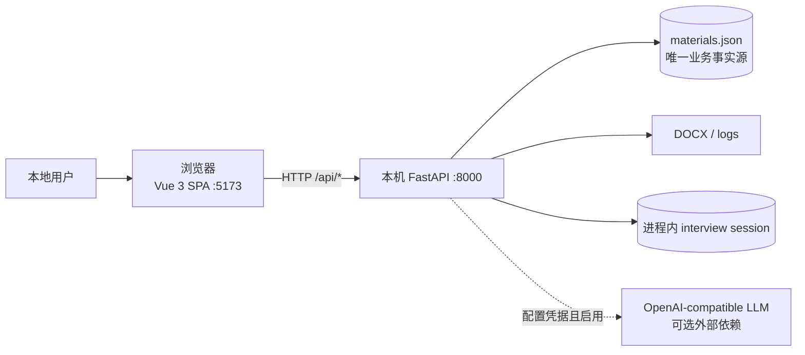
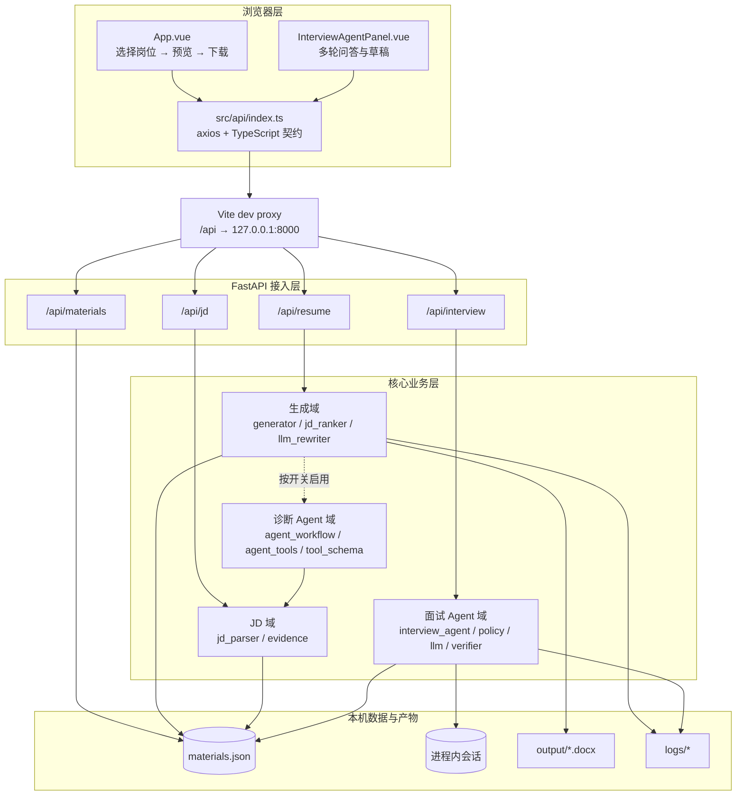
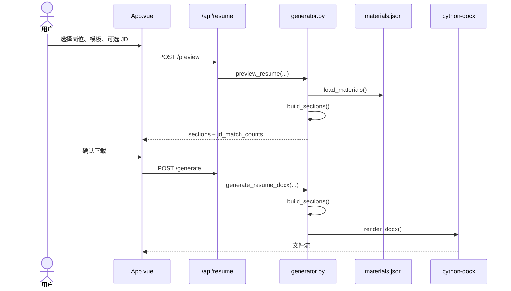
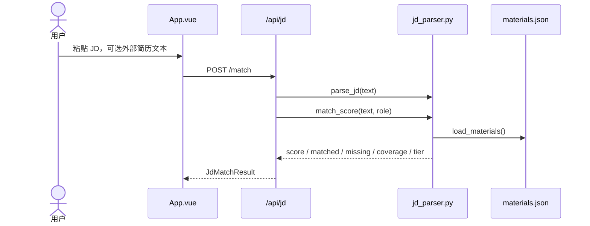
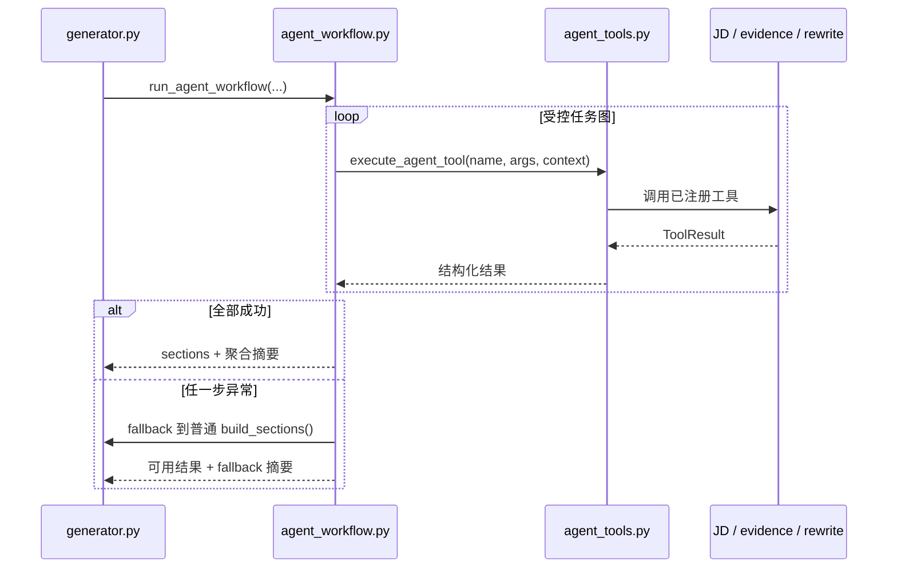
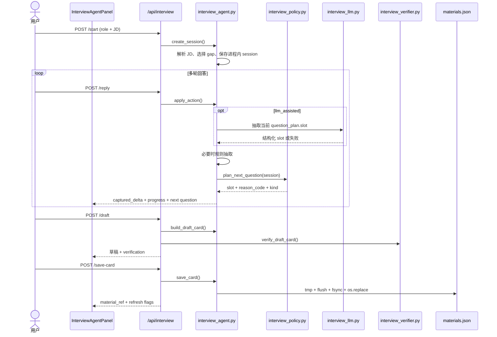
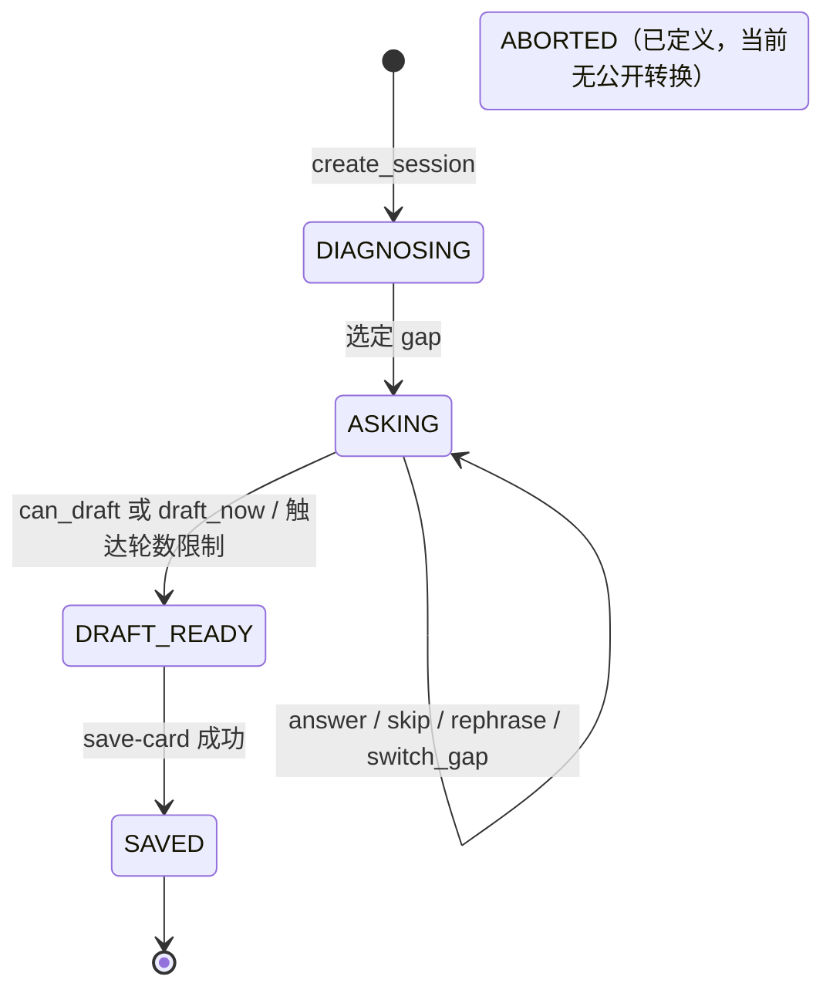
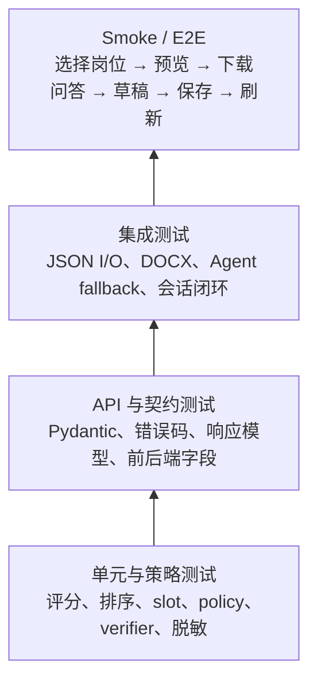
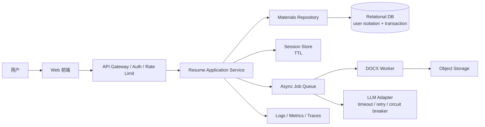

# Resume-Buff（简历帮）：测试开发面试项目拆解手册

> 文档定位：面向测试开发实习岗位的项目讲述、系统设计与追问准备<br>
> 描述口径：以当前实现（as-is）为主，生产化方案（to-be）单独标识<br>
> 代码基准：`ddfaeb0`，2026-07-11<br>
> 配套开发者文档：`.harness/docs/system-architecture.md`<br>
> 安全边界：当前 API 无鉴权，只用于本地单用户场景，不得直接暴露公网

## 0. 怎么使用这份手册

面试时不要从技术栈清单开始背。建议按下面的层次回答：

1. 先用 30 秒说明用户问题、核心方案和个人职责。
2. 用 3–5 分钟讲清主链路、两个工程难点和质量保障。
3. 面试官追问时，再进入模块、数据流、状态机、异常降级和测试设计。
4. 讨论不足时，明确区分当前实现与生产化演进，不把设想包装成已实现能力。

本文中的四种标签：

- **已实现**：代码中存在并可通过仓库定位或测试验证。
- **测试重点**：适合从测试开发角度展开的验证对象。
- **当前限制**：已知边界或技术债。
- **生产化建议**：尚未实现的演进方向。

## 1. 项目定位与面试叙事

### 1.1 一句话定义

Resume-Buff 是一款本地单用户简历助手：以结构化素材库为唯一业务事实源，根据目标岗位和 JD 生成针对性简历，并通过多轮问答补齐素材缺口；规则链保证基础可用，LLM 与 Agent 只作为可降级的增强层。

### 1.2 解决的问题

传统做法通常是复制多份 Word 简历后逐份修改，主要有三个问题：

1. 同一段经历在不同版本里容易失去一致性。
2. 针对 JD 的项目排序和关键词覆盖依赖人工判断，效率低且不可重复。
3. 发现素材缺口后，只能回到原文档手工补充，缺少“提问—核验—入库—重新生成”的闭环。

本项目把问题拆成三个稳定能力：

- **素材管理**：项目、技能、证书等统一存入 `materials.json`。
- **确定性生成**：规则解析 JD，稳定地排序项目、亮点和技能组。
- **受控增强**：Agent 做诊断，LLM 做改写或 slot 抽取；失败时回退规则路径。

### 1.3 个人职责表述

建议使用下面的口径：

> 我独立完成了需求拆解、前后端实现、规则与 Agent 链路、自动化回归和架构文档。项目不是简单调用大模型，而是先建立确定性的素材库和规则生成基线，再把 LLM 设计成可选增强。测试重点覆盖输入契约、评分边界、状态机、异常降级、文件一致性和隐私泄漏。

### 1.4 30 秒版本

> 我做的是一个本地单用户的针对性简历生成工具。用户只维护一份结构化素材库，系统根据岗位和 JD 生成预览与 DOCX；预览和下载共享同一生成函数，避免所见与下载不一致。项目还支持 JD 匹配和多轮问答补素材。为了避免 LLM 不稳定影响主流程，我把规则路径作为默认基线，Agent 或 LLM 失败会自动 fallback。质量上用 pytest、API 契约、类型检查、前端构建、离线评测和隐私扫描做回归门禁。

### 1.5 3–5 分钟版本

可以按“背景—方案—难点—测试—结果—反思”讲述：

> **背景**：我在准备不同 AI 和测试岗位时，发现每个 JD 强调的项目和关键词不同。如果复制多份 Word 简历手工维护，版本容易不一致，而且很难复用历史修改。
>
> **方案**：我把个人经历拆成结构化素材库，用 FastAPI 提供材料、简历、JD 和面试四组接口，Vue 3 前端负责选择岗位、预览、评分和下载。后端先用纯规则解析 JD，再对项目、亮点和技能做稳定排序，最后由 python-docx 渲染文档。
>
> **难点一是内容一致性**：预览和下载如果走两套逻辑，会出现页面看见的内容和最终文件不同。因此两条路径共享 `build_sections()`，区别只在输出层，一个转 JSON，一个渲染 DOCX。
>
> **难点二是 AI 能力的不确定性**：项目支持可选 Agent 诊断和 LLM slot 抽取，但默认规则路径不依赖外部服务。无 key、网络错误、JSON 或 schema 错误时都会回退规则抽取，保证核心简历仍然可生成。
>
> **难点三是新增事实可信度**：面试补素材走 JD 缺口识别、多轮追问、结构化抽取、草稿生成、事实核验和用户确认，最后才原子写回素材库。核验器发现 unsupported 或低置信度内容会返回显式 warning，避免把核验异常误判成全部通过。
>
> **质量保障**：我把规则、排序、状态转换和降级做成单元测试，把 Router 的参数和错误码做 API 契约测试，再用前端类型检查、构建和主流程 smoke 做集成验证。仓库记录的当前活跃基线是 948 个 pytest 用例全过、0 skipped；实际面试时我会展示最新一次实跑结果，而不是只背测试数量。
>
> **反思**：当前设计适合本地单用户，因此没有为了架构复杂度提前引入数据库和微服务。它的主要技术债是 JSON 写策略不完全统一、缺少跨请求写锁、会话只在进程内。如果生产化，我会先解决数据一致性和恢复，再做鉴权、多用户隔离和异步任务。

## 2. 系统边界与技术栈

### 2.1 系统上下文图



面试时要主动说明：

- 系统没有数据库、消息队列、认证系统或向量数据库。
- 顶层 `AI岗位JD库_v4_intern.json` 是个人筛选资料，不是后端运行时数据源。
- CORS 仅允许本机 Vite 地址，但 CORS 不等于身份认证。
- 当前架构选择是由“本地、单用户、低部署成本”的产品边界决定的。

### 2.2 技术栈与职责

| 层 | 技术 | 当前职责 | 测试关注点 |
|---|---|---|---|
| 前端 | Vue 3、TypeScript、Vite、Element Plus、axios | 三段式主流程、JD 评分、面试面板、下载 | 状态同步、按钮门禁、错误提示、类型契约 |
| API | FastAPI、Pydantic、CORS | 路由、校验、响应模型、错误翻译 | 400/404/422、边界值、响应字段 |
| 业务 | Python core 模块 | 生成、排序、评分、Agent、状态机 | 纯函数、策略优先级、降级与回归 |
| 文档 | python-docx | 将 sections 渲染为 DOCX | 预览一致性、结构与文件可打开 |
| 外部解析 | python-docx、pypdf | 解析 DOCX/PDF/TXT | MIME、大小、乱码、异常文件 |
| LLM | OpenAI-compatible HTTP API | 可选改写、可选 slot 抽取 | stub、schema、retry、fallback、隐私 |
| 数据 | JSON + 进程内 dict/deque | 素材真源和短期会话 | 原子性、并发写、重启丢失 |
| 验证 | pytest、vue-tsc、Vite build、评测脚本 | 自动化回归与质量门禁 | 可重复、无跳过、报告不泄密 |

## 3. 分层架构与核心模块

### 3.1 分层架构图



### 3.2 核心模块职责

| 模块 | 主要职责 | 关键边界 | 适合的测试类型 |
|---|---|---|---|
| `generator.py` | 构造 sections、预览、DOCX 生成、模板渲染 | 预览和下载共享 `build_sections()` | 快照/结构断言、模板参数化、文件 smoke |
| `jd_parser.py` | JD 解析、匹配评分、外部简历对比 | 纯规则，不调用 LLM | 等价类、阈值边界、确定性、关键词变体 |
| `jd_ranker.py` | 稳定排序项目、亮点和技能组 | 纯函数，不反向依赖 parser | 排序稳定性、并列分数、空输入 |
| `llm_rewriter.py` | 可选 LLM 改写与 function calling | 无 key 或异常时保留可用结果 | mock 网络、超时、非法响应、fallback |
| `agent_workflow.py` | 执行受控 Plan-and-Execute 任务图 | 只经工具注册表执行；失败回退旧路径 | 步骤异常、工具错误、fallback 摘要 |
| `agent_tools.py` | 工具注册、参数 schema、权限和统一执行 | 工具调用入口集中 | 未知工具、非法参数、权限拒绝 |
| `evidence.py` | 素材切片的关键词检索 | lexical retrieval，不是向量检索 | 召回、空查询、同义词局限 |
| `interview_agent.py` | 会话、状态机、填槽、草稿和保存 | 独立于诊断 Agent 域 | 状态转换、slot 对齐、保存异常 |
| `interview_policy.py` | 以确定性优先级选择下一问 | 不联网、不调 LLM、不修改 session | 决策表、边界轮数、防重复 |
| `interview_llm.py` | 可选 LLM slot 抽取、JSON/schema 校验 | 解析错误最多重试一次；网络错不重试 | JSON/schema/network 三类失败 |
| `interview_verifier.py` | 标记 unsupported 与低置信度内容 | warning 不阻断用户编辑和保存 | 支持度、置信度、sentinel、防泄密 |
| `logger.py` | 生成日志和 Agent trace | 记录摘要和尺寸，不记录敏感原文 | 脱敏、写入失败不阻断主流程 |

### 3.3 两个 Agent 域不能混为一谈

这是面试中容易说错的地方：

- **诊断 Agent 域**服务于简历生成流程，通过 `agent_workflow.py` 和 `agent_tools.py` 执行受控任务图。
- **面试 Agent 域**服务于素材补全，核心是 `interview_agent.py` 的状态机以及 policy、LLM 抽取和 verifier。
- `interview_*` 不依赖 `agent_workflow`、`agent_tools`、`llm_rewriter`、`evidence`、`tool_schema` 或 `core.session`。

这种隔离使两条链路可以独立测试和降级，也避免把所有 AI 能力堆进一个“大 Agent”。

## 4. 四条核心数据流

### 4.1 数据流 A：简历预览与下载



**核心设计**：预览与下载共享 `build_sections()`，以同一业务结构作为内容一致性的基础。

**测试设计**：

1. 固定素材、岗位、JD 和模板，对 preview sections 与 generate 前的 sections 做结构一致性断言。
2. 参数化覆盖无 JD、有 JD、未知岗位、未知模板、空项目列表和自定义项目顺序。
3. 对生成文件做 smoke：存在、非空、可由 `python-docx` 重新打开、关键标题存在。
4. 不建议直接比较 DOCX 二进制，因为时间戳和压缩元数据可能导致不稳定。

### 4.2 数据流 B：JD 解析与匹配



**核心设计**：纯规则实现保证可解释、可重复；评分档位为高分 `>=80`、中分 `60–79`、低分 `<60`。

**测试设计**：

- 阈值边界：59、60、79、80。
- 文本等价类：大小写、空白、中文/英文关键词、重复关键词、超长文本。
- 角色参数：合法 role、未知 role、默认/通用角色。
- 确定性：相同输入重复执行，分数、命中和缺失项完全一致。
- 反向用例：JD 资料库扩充不应自动改变运行时规则，因为两者当前是分离的。

### 4.3 数据流 C：可选 Agent 诊断



**核心设计**：Agent 是增强层，不是核心链路的单点依赖。

**测试设计**：

- 为每个任务步骤注入异常，验证最终仍返回普通生成结果。
- 验证未知工具、schema 错误和权限错误不能绕过统一执行入口。
- 验证 fallback 摘要只含步骤名、错误类型和计数，不含 JD、evidence 或 bullet 原文。
- 验证 `enable_agent_workflow=false` 时不应发生 Agent 调用。

### 4.4 数据流 D：面试素材补全闭环



**核心设计**：问什么 slot、抽取什么 slot必须一致；用户确认后的事实才写入唯一真源。

**测试设计**：

1. 四类 gap 各走完整问答，断言每轮 `question_plan.slot == captured_delta` 的目标字段。
2. `can_draft=false` 时调用 `/draft` 应返回 400。
3. 覆盖 answer、skip、rephrase、switch_gap、draft_now 以及非法 action。
4. 覆盖最大轮数、连续跳过、低置信度重问、critical slot 和 anti-repeat。
5. 保存前校验 edited card 必填字段、bullet 非空和长度上限。
6. 模拟 tmp 写入、`fsync` 和 `os.replace` 失败，验证原文件不出现半写内容。

## 5. 面试 Agent 状态机与确定性策略

### 5.1 状态机



需要准确说明：

- `DIAGNOSING` 是创建过程中的短暂状态，正常 API 返回时已经进入 `ASKING`。
- `ABORTED` 存在于枚举中，但当前没有公开 abort 端点。
- interview session 只存在进程内，服务重启即丢失。

### 5.2 下一问策略

`plan_next_question()` 是纯只读策略，不联网、不调用 LLM、不修改 session。主要优先级如下：

1. 无 gap：`no_more`。
2. 连续 skip 或轮数触顶：`force_draft`。
3. 缺少任一可成稿组合所需 slot：优先询问。
4. 已捕获但低置信度：重新确认。
5. gap-specific critical slot：在有限轮次内优先补齐。
6. 接近轮数上限：优先 result/metric。
7. 按 suggested slots 继续，并应用 anti-repeat。
8. 全部覆盖：`no_more`。

适合使用决策表和参数化测试，因为策略由多个条件和优先级共同决定。测试不只要覆盖每个分支，还要验证冲突时的优先级，例如“低置信度”和“接近轮数上限”同时成立时必须先重问低置信度 slot。

## 6. 异常处理与降级矩阵

| 故障场景 | 当前行为 | 是否阻断核心任务 | 关键断言 |
|---|---|---:|---|
| Agent 未启用 | 直接走普通 `build_sections` | 否 | 不调用工具注册表 |
| Agent 任一步失败 | 回退普通生成并返回摘要 | 否 | 简历仍可预览/生成 |
| 简历改写无 key 或失败 | 保留规则/原始生成结果 | 否 | 内容非空，不泄漏 key |
| interview LLM 未启用或无 key | 使用 rules mode | 否 | 模式和 warning 正确 |
| LLM 网络错误 | 不重试，回退规则抽取 | 否 | fallback 计数 +1 |
| LLM JSON/schema 错误 | 最多解析重试一次，再回退规则 | 否 | retry 和 fallback 计数准确 |
| verifier 发现 unsupported/低置信度 | 返回 sentinel 和 warnings | 否 | 不能显示“全部 verified” |
| `can_draft=false` 请求草稿 | HTTP 400 | 是 | 不生成不完整草稿 |
| edited card 非法 | HTTP 400/422 | 是 | 不修改素材库 |
| trace 写入失败 | 捕获异常 | 否 | 主业务响应正常 |
| 素材写入中断 | save-card 使用临时文件和原子替换 | 视故障点 | 原文件不出现半写 |

测试开发的回答重点不是“系统不会失败”，而是：失败是否被分类、是否可观测、是否污染数据、是否有明确的降级边界。

## 7. 测试策略与质量门禁

### 7.1 风险驱动测试金字塔



分层原则：

- 纯规则和策略尽量放在快速单元测试中，覆盖大量组合。
- Router 测试关注 HTTP 契约，不重复业务模块所有分支。
- 文件、会话、Agent 编排和 fallback 用集成测试验证协作关系。
- E2E 只保留少量最关键主流程，降低脆弱性和执行成本。

### 7.2 与百运网测试开发岗位职责的对应

| 岗位职责 | 项目证据 | 面试展开方式 |
|---|---|---|
| AI 系统功能测试与回归测试 | JD/Agent/interview 多链路测试，固定 pytest 回归基线 | 讲规则确定性、LLM 非确定性和回归门禁的不同策略 |
| 编写测试用例、记录并跟踪 Bug | 边界用例、状态机用例、真实 slot 错位缺陷及 4 gap 回归 | 用“发现—定位—修复—回归—防复发”闭环回答 |
| 自动化测试脚本或 AI 生成测试数据 | pytest、评测脚本、离线 compare、隐私扫描 | 强调 AI 可以辅助生成候选用例，但断言和风险优先级由人审核 |
| Python 或 TypeScript | FastAPI/pytest 后端与 Vue/TS 前端 | 说明分别用于接口、业务测试和前端契约 |
| 逻辑分析与文档能力 | 架构图、状态机、数据流、降级矩阵 | 展示本手册和开发者架构文档 |

### 7.3 自动化用例设计示例

#### 示例一：JD 评分边界

| 用例 | 输入 | 预期 |
|---|---|---|
| 高分下界 | 构造 score = 80 | tier = high |
| 中分上界 | 构造 score = 79 | tier = medium |
| 中分下界 | 构造 score = 60 | tier = medium |
| 低分上界 | 构造 score = 59 | tier = low |
| 重复执行 | 同一 JD 与素材执行两次 | 完整结果相同 |

#### 示例二：LLM slot 抽取降级

| 用例 | Mock 行为 | 预期 |
|---|---|---|
| 正常 JSON | 返回合法 envelope 和 schema | source = llm，不 fallback |
| 非法 JSON 后成功 | 首次解析失败，retry 成功 | retry_count +1 |
| 两次 schema 非法 | 两次都缺字段或类型错误 | 回退 rules，fallback_count +1 |
| 网络超时 | 抛 TimeoutError | 不做解析重试，直接回退 rules |
| 无 key | 未配置凭据 | rules mode，不发网络请求 |

#### 示例三：save-card 文件一致性

| 用例 | 故障注入 | 预期 |
|---|---|---|
| 正常保存 | 无 | 新项目写入，状态转 SAVED |
| edited card 非法 | 缺字段/空 bullet/超长 | 报错且原文件不变 |
| tmp 写失败 | mock `open`/写入异常 | 原文件不变 |
| fsync 失败 | mock `os.fsync` | 原文件不变，临时文件可被清理 |
| replace 失败 | mock `os.replace` | 原文件仍为旧版本 |
| 连续保存 | 同一会话重复请求 | 当前实现可能生成多条；记录为幂等性风险，不伪造“已解决” |

### 7.4 当前质量门禁

仓库记录的活跃基线：

- 后端：`D:\python3.11\python.exe -m pytest tests/ -q`，948 passed、0 skipped。
- 前端类型：`npx vue-tsc --noEmit`。
- 前端构建：`npm run build`。
- 离线 Agent 评测：`scripts/evaluate_interview_agent.py`。
- 隐私检查：扫描评测报告与 stderr，不得包含 key、Bearer、prompt、source span 或用户原文。

面试时应说明“测试数量不是唯一指标”。更重要的是：

- 新缺陷是否有最小复现和回归用例。
- 用例是否锁定了行为契约，而不是绑定实现细节。
- 是否覆盖失败路径、数据污染和隐私边界。
- 测试是否可重复、可定位、执行时间可接受。

## 8. 一个真实缺陷的完整复盘

### 8.1 现象

communication gap 完成三轮回答后，前端已经询问“结果”，但 `/draft` 仍返回 400，`can_draft` 一直为 false。

### 8.2 根因

- `plan_next_question()` 根据 `CAN_DRAFT_CONDITIONS` 判断缺少 `result`，因此 UI 提问 `result`。
- `_do_answer()` 过去通过 `_current_slot()` 选择写入字段。
- `_current_slot()` 按 `suggested_slots = (background, action, method, result)` 找第一个未填 slot。
- 此时 background 和 action 已填，所以它返回 method。
- 用户回答的结果被错误写入 method，导致 result 永远为空。

### 8.3 修复

`_do_answer()` 改为：

1. 优先读取 `session.question_plan["slot"]`。
2. 不存在时才回退 `_current_slot(session)`，兼容旧路径。
3. 再回退空字符串，避免未知 slot 抛异常。

### 8.4 回归设计

- communication、process_metric、tech_metric、domain_x 四类 gap 各覆盖三轮问答。
- 验证每轮计划 slot、抽取 slot 和 `captured_delta` 一致。
- 覆盖 `question_plan.slot=""` 与 `question_plan=None` 的 fallback。
- API smoke 验证最终 `/draft` 返回 200 且至少产生一条 bullet。

### 8.5 面试表达模板

> 这个缺陷的关键不是某一行写错，而是“决策源”和“执行源”不一致。policy 决定问 result，抽取却按另一个顺序写 method。我先通过状态和 captured delta 缩小范围，再比较 question plan 与实际 slot，最后采用单一决策源的最小修复，并用四类 gap 加 fallback 边界做回归。这个案例让我更重视跨模块契约测试，而不只是各函数单测。

## 9. 安全、隐私与可观测性

### 9.1 当前安全边界

1. 所有 `/api/*` 无认证，只适合本机。
2. `materials.json` 在仓库中使用脱敏数据，真实 PII 不应提交。
3. 外部简历上传内容在内存解析，parser 不主动落盘。
4. LLM 凭据来自环境变量，不应进入响应、trace 或评测报告。
5. Agent 前端摘要只暴露计数、步骤和短建议，不暴露原始 JD、evidence、bullet 或 `source_span`。

### 9.2 可观测性指标

面试 Agent 已记录：

- `slot_source_breakdown`：rules / llm / mixed 的轮次统计。
- `llm_parse_retry_count`：JSON 或 schema 解析重试次数。
- `llm_to_rules_slot_fallback_count`：LLM 失败后回退规则的次数。

这些字段只存枚举和整数，不应包含 user message、source span、prompt、raw response 或 API key。

### 9.3 隐私测试

- 构造带 `sk-`、`Bearer`、密钥变量名和用户原文 sentinel 的异常。
- 触发网络错误、schema 错误、报告输出和 stderr。
- 对 API 响应、日志、trace、报告做 forbidden-string 扫描。
- 断言错误信息仍保留错误类型、步骤和 request/session id，避免“为了脱敏而无法诊断”。

## 10. 当前技术债

| 技术债 | 当前事实 | 风险 | 优先级 |
|---|---|---|---|
| 无认证 API | 全部接口本地开放 | 误暴露公网后可读写个人数据 | P0（若要部署） |
| JSON 写策略不统一 | save-card 原子替换，materials PUT 直接覆盖 | 并发请求可能丢更新或半写 | P0 |
| 无跨请求写锁 | 两条写路径可同时修改素材库 | 最后写入者覆盖前一更新 | P0 |
| session 只在进程内 | 无 TTL、持久化、跨 worker 共享 | 重启丢会话，多 worker 不一致 | P1 |
| 重复 save 非幂等 | 连续请求可能生成不同项目 id | 重试导致重复素材 | P1 |
| 核心文件职责偏重 | App、generator、interview_agent、jd_parser 较大 | 定位与修改影响面扩大 | P1 |
| lexical evidence | 只做关键词检索 | 同义表达召回有限 | P2 |
| JD 库与规则分离 | 资料库不直接驱动运行时规则 | 扩库不会自动更新评分词典 | P2 |

## 11. 生产化演进设计

本节全部是 **to-be**，不是当前已实现能力。

### 11.1 演进原则

1. 先解决数据一致性和故障恢复，再扩展多用户。
2. 先建立可观测指标和容量基线，再拆分服务。
3. 保留规则基线和降级能力，不让 LLM 成为不可控单点。
4. 不为了“技术栈高级”提前引入微服务、队列或向量库。

### 11.2 分阶段路线

#### P0：本地数据可靠性

- 抽象 `MaterialsRepository`，统一所有读写入口。
- 全部写入使用临时文件、`fsync`、原子替换和进程内写锁。
- 引入版本号或文件摘要，检测 lost update。
- 增加备份、JSON 损坏恢复、迁移脚本和故障注入测试。
- 为 save-card 引入 idempotency key 或请求去重。

#### P1：会话与可观测性

- interview session 增加 TTL、清理任务和持久化适配器。
- 建立 request id、session id、结构化错误码和统一日志字段。
- 监控生成成功率、P95 时延、fallback 率、LLM parse retry 率、素材写失败率。
- 增加 API 契约、性能基线、资源泄漏和长时间稳定性测试。

#### P2：多用户服务化

- 引入认证、授权和用户级数据隔离。
- JSON 迁移到关系数据库，使用事务和乐观锁。
- DOCX 与 LLM 长任务按容量评估后进入任务队列。
- 增加限流、审计、密钥管理、备份恢复和租户隔离测试。

### 11.3 生产化目标架构



如果面试官问“为什么不直接上微服务”，可以回答：当前并没有独立扩缩容、团队边界或部署频率需求，先做模块化单体更合适；只有当 DOCX/LLM 长任务、并发量或团队协作形成明确瓶颈时，才基于指标拆分。

## 12. 高频追问与回答要点

### 12.1 为什么不用数据库？

当前是本地单用户工具，JSON 让部署和备份更简单；同时通过唯一真源和 save-card 原子替换降低损坏风险。它的代价是并发、事务和查询能力有限。如果转为多用户产品，我会先抽象 Repository，再迁移关系数据库，而不是让业务层直接依赖文件或 SQL。

### 12.2 为什么 JD 匹配不用 LLM？

核心评分需要稳定、可解释、可回归，规则更适合作为基线。LLM 可以用于语义扩展或建议，但不应该在没有评测证据时直接替换确定性评分。可以通过固定数据集比较 precision、recall、稳定性、时延和成本后再决定。

### 12.3 LLM 输出不稳定怎么测？

分两层：单元和契约测试使用 stub 固定返回，覆盖合法、非法 JSON、schema 错误、网络错误和超时；真实模型使用固定 eval set 看 schema pass、完整度、fabrication、fallback 和成本。CI 不依赖实时外部模型，live eval 作为独立门禁或定期任务。

### 12.4 如何防止简历内容编造？

主生成链只消费素材库。面试问答新增内容记录来源和置信度，草稿经过 verifier 标记 unsupported 与 low-confidence，再由用户编辑确认后入库。当前 verifier 是提示型而非强阻断，因此 UI 文案和 sentinel 必须避免把失败显示为“全部通过”。

### 12.5 为什么 Agent 要有工具注册表？

为了把“模型想做什么”和“系统允许做什么”分开。工具名、参数 schema、权限和执行入口集中管理后，可以测试未知工具、越权、非法参数和异常降级，也便于 trace 每一步，而不是让模型任意调用内部函数。

### 12.6 预览和下载如何保证一致？

两者共享 `build_sections()` 生成业务结构，预览把它序列化为 JSON，下载把同样的 sections 交给渲染器。测试重点是比较结构化内容而不是 DOCX 二进制，并对最终文档做可打开和关键文本 smoke。

### 12.7 最难定位的 Bug 是什么？

使用第 8 节的 slot 错位案例。重点讲决策源与执行源不一致、如何通过 captured delta 定位、为什么选择最小修复，以及怎样用跨模块契约回归防复发。

### 12.8 如果测试时间只有一天，怎么排序？

按“数据损坏 > 核心任务阻断 > 错误结果 > 降级失效 > UI 体验”排序：先测素材写入、预览/生成、JD 阈值、draft 门禁和 LLM fallback，再覆盖次要模板和视觉细节。

### 12.9 如何生成测试数据？

规则链使用人工构造的最小关键词组合和边界样本；状态机使用参数化 session factory；LLM 使用合法/缺字段/错类型/非 JSON envelope；文件解析使用正常、空、损坏、超限和伪造 MIME 样本。AI 可以扩充候选数据，但预期结果和风险分类必须由测试人员审核。

### 12.10 项目最大的不足是什么？

不是回答“功能还不够多”，而是指出工程风险：JSON 写策略不统一、无跨请求写锁、session 不持久、重复保存非幂等、部分文件职责偏重。再说明会优先解决数据一致性，因为它比引入更多 AI 功能更影响可信度。

## 13. 面试现场架构图速画版

白板时间有限时，只画下面五层：

```text
用户
  ↓
Vue 3 前端：选择岗位 / JD 评分 / 面试问答 / 下载
  ↓  /api/*
FastAPI：materials / resume / jd / interview
  ↓
Core：生成规则 | JD 规则 | 可选 Agent | 面试状态机
  ↓                         ⇢ 可选 LLM（失败回退 rules）
materials.json | session | DOCX | logs
```

画完后主动补三句话：

1. `materials.json` 是唯一业务事实源。
2. 预览和下载共享 `build_sections()`。
3. Agent/LLM 是可降级增强，不是核心生成的单点依赖。

## 14. 面试前自检清单

### 项目事实

- [ ] 能区分诊断 Agent 与面试 Agent。
- [ ] 能说明 JD 评分是规则，不是 LLM。
- [ ] 能说明当前没有数据库、鉴权、消息队列和向量库。
- [ ] 能解释 preview/generate 的共享边界。
- [ ] 能解释 interview session 与 `core.session` 不是同一套状态。

### 测试能力

- [ ] 能讲一个阈值边界测试。
- [ ] 能讲一个 LLM fallback 测试。
- [ ] 能讲一个状态机/决策表测试。
- [ ] 能完整复盘 slot 错位缺陷。
- [ ] 能说明为什么不把实时 LLM 调用放进普通 CI。

### 工程判断

- [ ] 能区分 as-is 与 to-be。
- [ ] 能解释为什么当前使用 JSON。
- [ ] 能按风险给技术债排序。
- [ ] 能说明生产化为何先做一致性，再做微服务。
- [ ] 能展示最新实跑测试证据，不只背“948 个用例”。

## 15. 代码定位索引

| 想展示的能力 | 文件 |
|---|---|
| 路由与本地边界 | `backend/main.py` |
| 素材 CRUD | `backend/api/materials.py` |
| 预览与 DOCX | `backend/api/resume.py`、`backend/core/generator.py` |
| JD 规则与评分 | `backend/api/jd.py`、`backend/core/jd_parser.py` |
| Agent 任务图与工具 | `backend/core/agent_workflow.py`、`backend/core/agent_tools.py` |
| 面试状态机与保存 | `backend/api/interview.py`、`backend/core/interview_agent.py` |
| 下一问策略 | `backend/core/interview_policy.py` |
| LLM slot 抽取与降级 | `backend/core/interview_llm.py` |
| 草稿事实核验 | `backend/core/interview_verifier.py` |
| 前端 API 契约 | `frontend/src/api/index.ts` |
| 自动化回归 | `backend/tests/`、`scripts/verify.ps1` |

## 16. 结论

这个项目对测试开发岗位最有价值的地方，不是“用了多少 AI 技术”，而是展示了四种工程能力：

1. 把业务流程拆成可测试的模块和契约。
2. 用规则基线、异常分类和 fallback 控制外部 AI 的不确定性。
3. 通过状态机、决策表、回归用例和故障注入验证复杂流程。
4. 能诚实识别数据一致性、会话可靠性和安全边界，并给出按风险排序的演进方案。

面试中始终围绕“输入是什么、系统怎样处理、输出是什么、可能怎样失败、我如何验证”展开，就能把项目从功能展示提升为测试开发能力证明。
