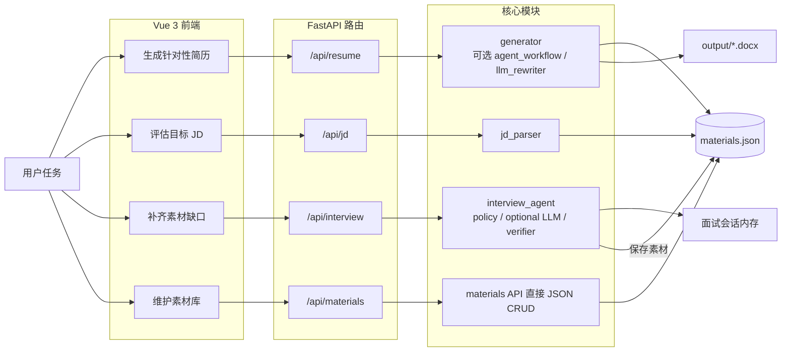
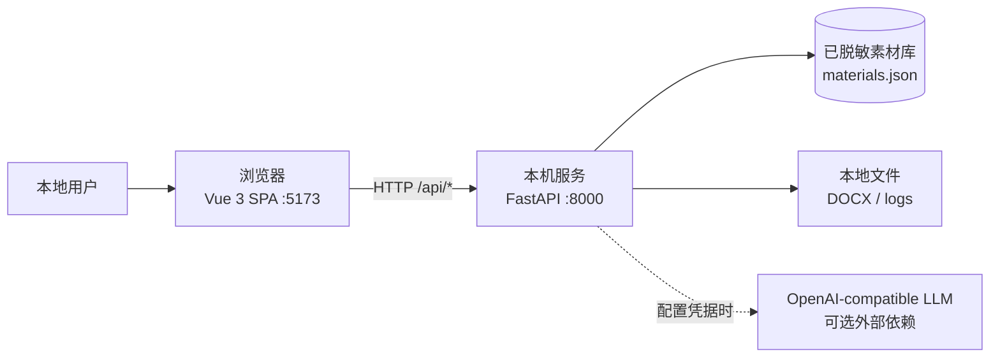
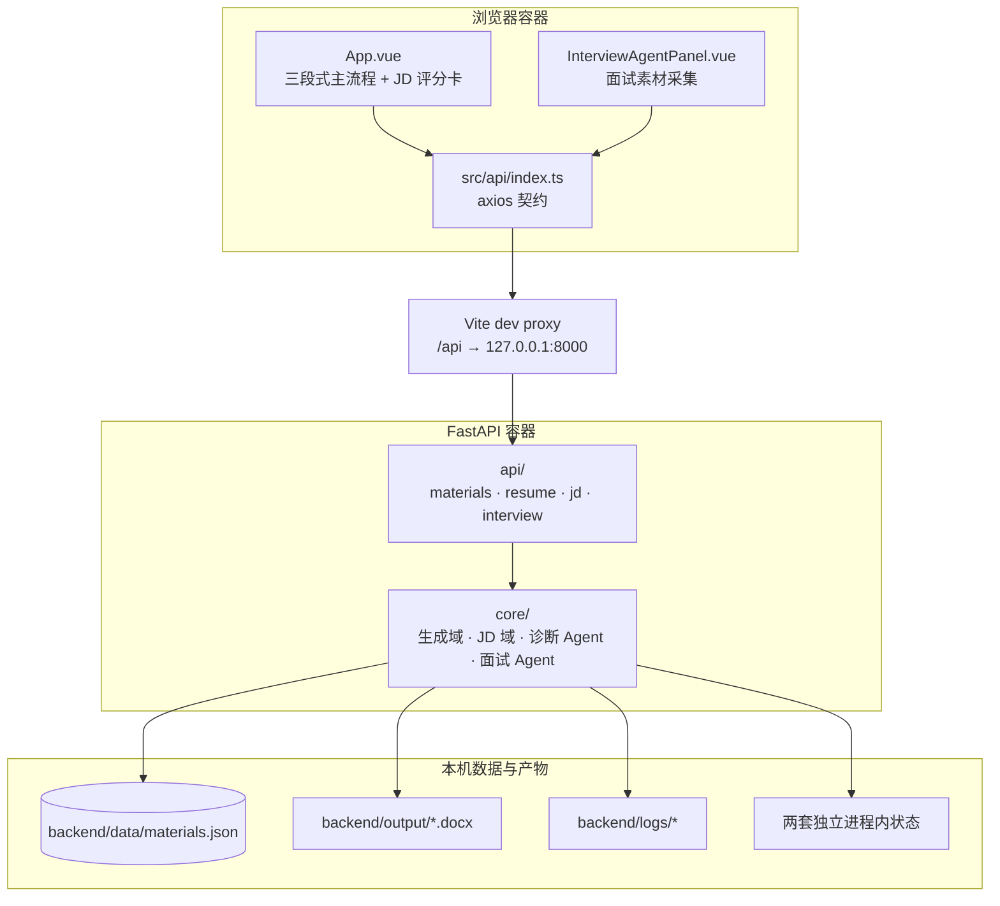
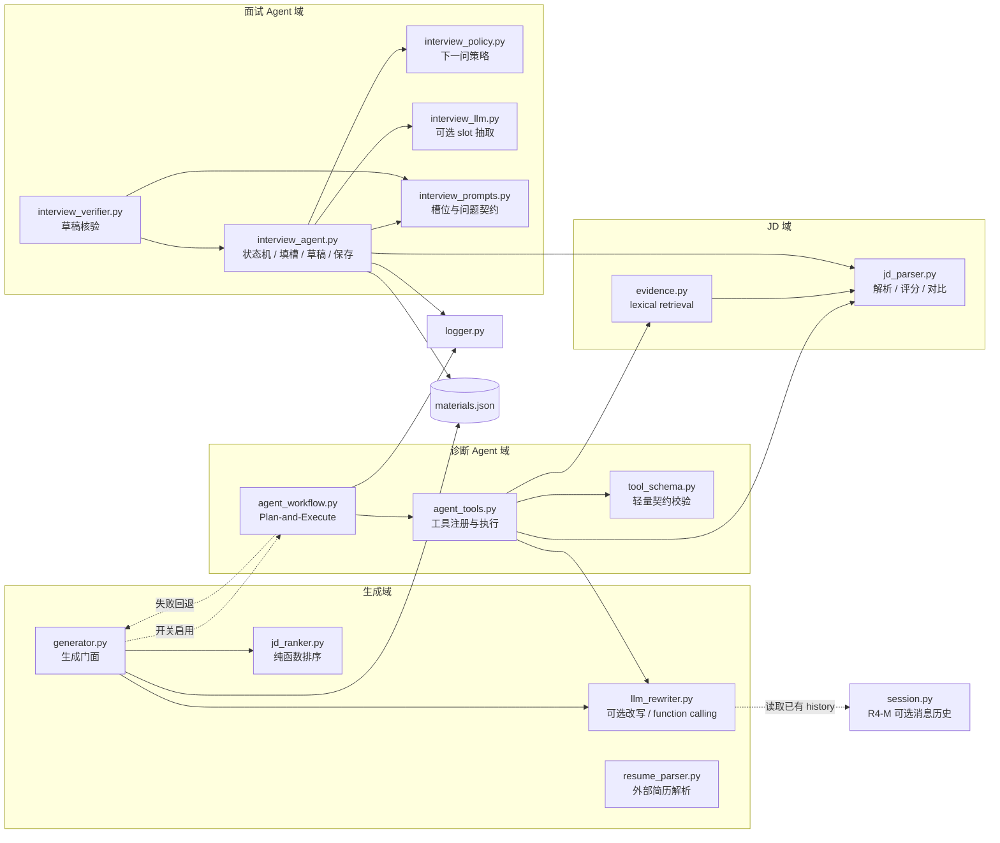
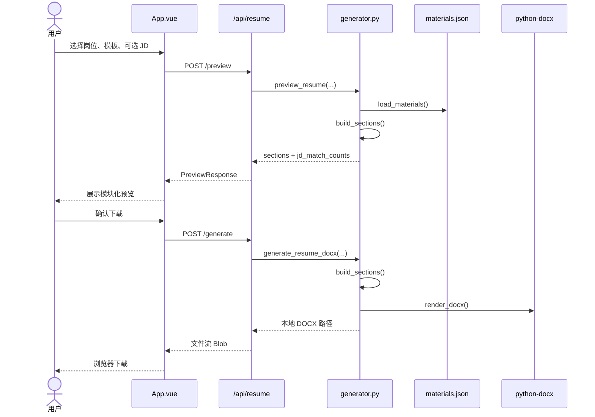
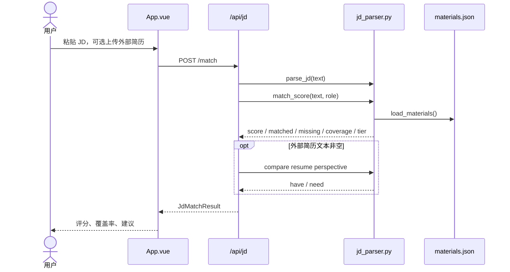
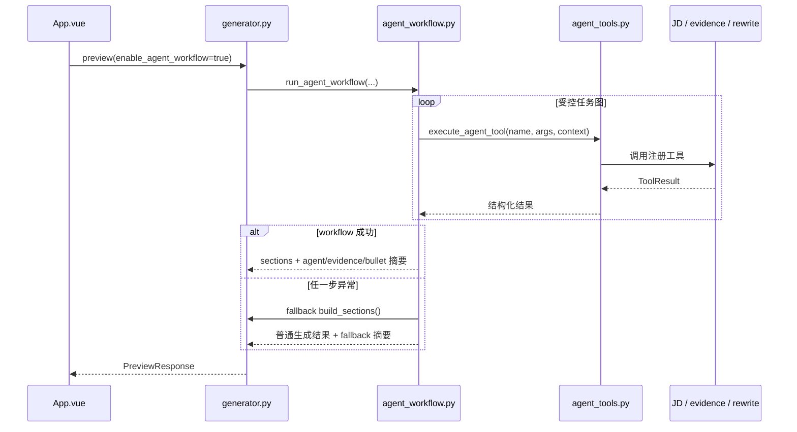
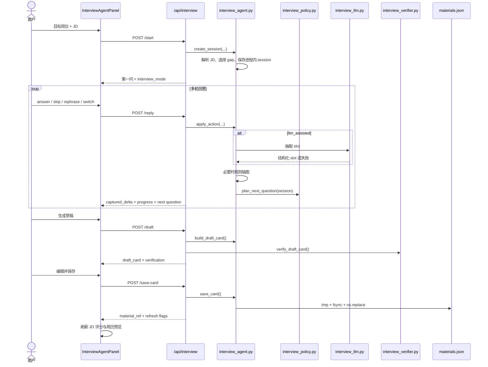
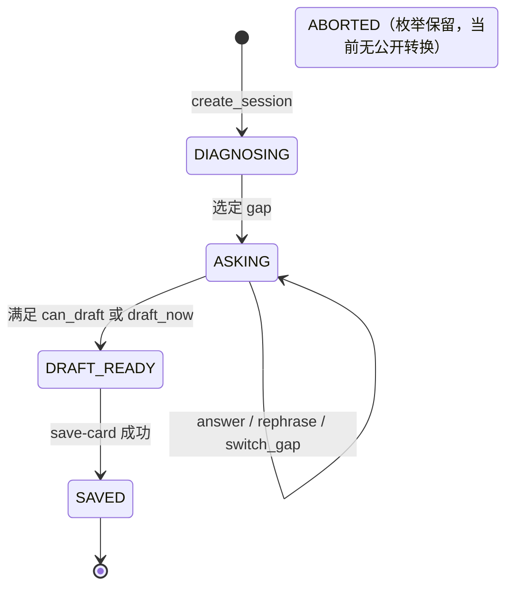

# 简历帮：系统架构与设计说明

> 文档状态：当前实现（as-is）<br>
> 主要读者：第一次接触仓库的开发者与 Agent<br>
> 校准日期：2026-07-10<br>
> 代码基准：`052fa6b`<br>
> 约束：本文只描述已经实现的架构；技术债集中列在第 9 节，不把设想写成现状。

## 0. 一分钟总览

简历帮是一款**本地单用户**简历助手：以 `backend/data/materials.json` 为唯一业务事实源，按目标岗位生成简历预览与 `.docx`，并提供 JD 匹配、可选 Agent 诊断和 JD 驱动的面试素材采集。

新开发者先记住五点：

1. 浏览器运行 Vue 3 SPA，经 Vite 的 `/api` 代理访问本机 FastAPI。
2. `generator.py` 是简历生成主门面；预览和下载共享 `build_sections()`。
3. JD 评分是纯规则链；Agent 与 LLM 都是可选增强，失败不能阻断核心生成链。
4. `materials.json` 是唯一业务真源；面试素材保存后会回流该文件，重新影响评分与预览。
5. 全部 API 无认证，只适用于本机，**不得直接暴露公网**。

### 0.1 四条业务链路



图的阅读顺序固定为：**用户任务 → 前端 → API → 核心模块 → 数据或产物**。

## 1. 系统边界与技术栈

### 1.1 系统上下文



系统内没有数据库、消息队列、身份系统或向量库。顶层 `AI岗位JD库_v4_intern.json` 是个人筛选资料，不是后端运行时数据源；后端匹配使用 `jd_parser.KEYWORD_GROUPS`。

### 1.2 技术栈

| 层 | 技术 | 当前职责 |
|---|---|---|
| 前端 | Vue 3、TypeScript、Vite、Element Plus、axios | SPA、交互状态、API 调用、DOCX 下载 |
| 接入层 | FastAPI、Pydantic、CORS | 路由、输入输出契约、错误码 |
| 业务层 | Python 标准库 + core 模块 | 生成、JD 规则、Agent 编排、面试状态机 |
| 文档渲染 | python-docx | 将 sections 渲染为 `.docx` |
| 外部简历解析 | python-docx、pypdf | `.docx/.pdf/.txt` 转内存段落 |
| LLM | OpenAI-compatible HTTP API，可选 | 简历改写、面试 slot 抽取；无凭据时降级 |
| 数据 | JSON 文件 + 进程内 dict/deque | 素材真源、短期运行状态 |
| 验证 | pytest、vue-tsc、Vite build、评测脚本 | 回归、类型、构建、Agent 指标与隐私检查 |

## 2. 容器与分层架构



分层约定：

- `frontend/src/api/index.ts` 统一维护前端 API 类型与请求封装。
- `backend/api/` 负责 HTTP 契约、基础校验和错误翻译；主要业务进入 `core/`。
- `backend/core/` 按能力分域，但不是完全无耦合的 Clean Architecture；真实依赖见第 3 节。
- `backend/data/` 是业务事实源；`output/`、`logs/` 是 `.gitignore` 中的运行时产物。

## 3. 后端核心模块与依赖

### 3.1 模块地图

下图箭头表示主要运行时调用或数据读取，不等同于完整 Python import 图；延迟导入用虚线表示。



面试 Agent 的刻意隔离边界：`interview_*` 不依赖 `agent_workflow`、`agent_tools`、`llm_rewriter`、`evidence`、`tool_schema` 或 `core.session`。它只复用 JD 解析、素材加载与日志能力。

### 3.2 路由层

| Router | 端点 | 职责 | 主要下游 |
|---|---|---|---|
| `materials.py` | `GET /`、`GET /summary`、`GET /projects/{id}`、`PUT /` | 素材库读取与整体覆盖更新 | 直接读写 `materials.json` |
| `resume.py` | `GET /roles`、`POST /preview`、`POST /generate`、`POST /parse-external` | 角色/模板、预览、DOCX、外部简历解析 | `generator`、`resume_parser`、`logger` |
| `jd.py` | `POST /parse`、`POST /match` | JD 解析、素材匹配、外部简历视角 | `jd_parser`、`generator.ENABLED_ROLES` |
| `interview.py` | `POST /start`、`POST /reply`、`POST /draft`、`POST /save-card` | 面试会话、追问、草稿、入库 | `interview_agent`、延迟 `interview_verifier` |

所有前缀由 `backend/main.py` 挂载为 `/api/materials`、`/api/resume`、`/api/jd`、`/api/interview`。

### 3.3 核心模块职责

| 模块 | 对外职责 | 关键依赖或边界 |
|---|---|---|
| `generator.py` | `build_sections`、`preview_resume`、`generate_resume_docx`、模板渲染 | 顶层依赖 `llm_rewriter`、`jd_ranker`；按开关延迟导入 `agent_workflow` |
| `jd_parser.py` | `parse_jd`、`match_score`、简历/JD 对比、bullet 评估 | 当前复用 `generator` 的角色配置和素材加载 |
| `jd_ranker.py` | 按 JD 命中数稳定排序项目、亮点、技能组 | 纯函数，不反向 import parser |
| `llm_rewriter.py` | 可选 LLM 改写、有限重试、function calling | 无 key 或调用失败时保留可用结果；可读取 `core.session` 历史 |
| `resume_parser.py` | 解析 `.docx/.pdf/.txt` 为段落 | 只在内存处理上传内容，不主动落盘 |
| `agent_workflow.py` | 构造任务图并执行受控步骤 | 只经 `agent_tools.execute_agent_tool` 调工具；失败回退普通生成路径 |
| `agent_tools.py` | 工具注册、参数/schema/权限校验、统一执行 | 调用 JD、evidence、LLM 改写和 schema 校验 |
| `evidence.py` | 从素材切片做关键词检索 | 无向量库、embedding 或持久索引 |
| `interview_agent.py` | 面试会话门面、状态机、规则抽取、草稿、原子保存 | 独立 `_INTERVIEW_SESSIONS`；不使用 R5 Agent 编排域 |
| `interview_policy.py` | 根据必填槽、置信度、轮数和防重复规则选择下一问 | 延迟调用，避免与 `interview_agent` 形成初始化循环 |
| `interview_llm.py` | LLM slot 抽取、JSON/schema 校验、一次解析重试、可观测计数 | 使用独立 interview mode；失败回退规则抽取 |
| `interview_verifier.py` | 校验草稿 claim 支持度和低置信度提示 | sentinel 防 verifier 失败被误读为全部通过；不阻止保存 |
| `logger.py` | 生成日志、Agent JSONL trace | 记录摘要与尺寸，不记录密钥和敏感原文 |
| `session.py` | R4-M 的进程内消息 deque | 当前主 API 没有创建/填充端点，详见第 6.2 节 |

## 4. 前端组件与 API 契约

### 4.1 组件树

```text
App.vue
├── ResumeUploader.vue
└── InterviewAgentPanel.vue
    ├── InterviewProgressPills.vue
    └── InterviewDraftCard.vue
```

- `App.vue` 管理 `select → preview → done` 主流程、JD 评分、Agent 诊断面板和素材保存后的刷新。
- `ResumeUploader.vue` 调用 `/resume/parse-external`，把解析后的纯文本交还 `App.vue`。
- `InterviewAgentPanel.vue` 管理 start/reply/draft/save-card；保存成功后触发 `refresh-match` 与 `refresh-preview`。
- `InterviewDraftCard.vue` 负责草稿编辑、验证提示和保存确认。

### 4.2 前端 API 对象

| 对象 | 方法 | 后端前缀 |
|---|---|---|
| `materialsApi` | `getSummary`、`getAll` | `/api/materials` |
| `resumeApi` | `listRoles`、`preview`、`generate`、`parseExternal` | `/api/resume` |
| `jdApi` | `parse`、`match` | `/api/jd` |
| `interviewApi` | `start`、`reply`、`draft`、`saveCard` | `/api/interview` |

`src/api/index.ts` 同时定义请求/响应 TypeScript 契约。Agent 和 interview 只向前端暴露聚合摘要、槽位名和计数；前端不展示 prompt、密钥、`source_span` 或 trace 中的敏感原文。

## 5. 四条核心数据流

### 5.1 数据流 A：简历预览与下载



`preview` 与 `generate` 共享 `build_sections()`，这是“预览与下载内容一致”的核心保证。JD 非空时，`jd_ranker` 调整项目、亮点和技能组的顺序，不裁掉素材。

### 5.2 数据流 B：JD 解析与匹配



该链路是纯规则实现，不调用 LLM。推荐阈值为：`score >= 80` 高、`60 <= score < 80` 中、`score < 60` 低。

### 5.3 数据流 C：可选 Agent 诊断



Agent 诊断是增强层，不是可用性前提。响应只携带 request id、步骤、工具名、计数和短建议，不携带 evidence/JD/bullet 原文。

### 5.4 数据流 D：面试素材采集闭环



这条链是唯一主动向素材库追加业务事实的交互流。保存采用临时文件加 `os.replace` 的原子替换；但没有跨请求写锁。

## 6. 状态、会话、错误与降级

### 6.1 面试状态机



`DIAGNOSING` 是创建过程中的短暂状态，API 正常返回时 session 已进入 `ASKING`。`ABORTED` 已定义在枚举中，但当前公开 API 没有独立 abort 端点。

### 6.2 两套独立进程内状态

| 存储 | 位置 | 当前用途 | 生命周期与限制 |
|---|---|---|---|
| 面试会话 | `interview_agent._INTERVIEW_SESSIONS` | 保存 `InterviewSession`：gap、状态、槽位、计划、验证摘要、可观测计数 | 活跃生产路径；进程退出即丢；无 TTL、锁和跨 worker 共享 |
| R4-M 消息历史 | `core.session._SESSIONS` | `dict[str, deque(maxlen=10)]`，供 `llm_rewriter._get_session_history()` 读取 | 当前主 API 没有创建/填充端点；前端随机 `agentSessionId` 只作关联 id，单独传入不会自动产生历史 |

因此，不要把 `core/session.py` 解释为 interview session，也不要假设前端生成 UUID 后就拥有服务端多轮消息历史。

### 6.3 降级矩阵

| 场景 | 行为 | 是否阻断核心任务 |
|---|---|---|
| `enable_agent_workflow=false` | 直接走普通 `build_sections` | 否 |
| Agent workflow 任一步异常 | 写 fallback 摘要并回退普通生成 | 否 |
| 简历改写无 LLM key 或调用失败 | 保留可用的规则/原始生成结果 | 否 |
| 面试智能抽取未启用或无 key | 使用 rules mode，必要时返回用户可见 warning | 否 |
| 面试 LLM 网络/JSON/schema 失败 | 解析错误最多重试一次，随后规则抽取 | 否 |
| trace 写入失败 | 捕获异常，不影响主流程 | 否 |
| verifier 发现 unsupported/low confidence | 返回 sentinel/warnings，允许用户编辑和保存 | 否 |
| `can_draft=false` 时请求草稿 | 返回 400，要求继续补槽 | 是，阻止生成草稿 |
| 素材卡字段、长度或 save mode 非法 | 返回 422 或 400 | 是，阻止写库 |

### 6.4 API 错误语义

- `422`：空或超长输入、未知角色、上传内容非法、edited card 校验失败。
- `404`：项目 id 或 interview session 不存在。
- `400`：action/save mode 非法，或尚未满足 draft 条件。
- 未显式转换的 I/O 与服务异常按 FastAPI 500 处理；前端统一显示 detail 或错误摘要。

## 7. 安全与隐私边界

1. **本地边界**：全部 `/api/*` 无认证，CORS 仅允许本机 Vite 地址；这不是公网部署安全模型。
2. **数据最小化**：版本库中的 `materials.json` 已脱敏；真实 PII 不应写入仓库。
3. **外部简历**：上传内容只在内存解析，不由 parser 主动落盘。
4. **LLM 可选**：凭据来自环境变量；API 响应、trace 和评测报告不得出现 key、Bearer 头或原始 prompt。
5. **Agent 摘要化**：前端消费聚合计数和短建议，不展示 evidence、JD、bullet、`source_span` 或 `user_message` 原文。
6. **日志脱敏**：日志以 request/session id、步骤、工具、时延、状态和输入输出尺寸为主；trace 失败不影响业务。
7. **运行时产物**：`backend/output/`、`backend/logs/`、`.env*` 均被 `.gitignore` 排除。

## 8. 验证矩阵

| 范围 | 命令或证据 | 验证目标 |
|---|---|---|
| 后端回归 | `cd backend && D:\python3.11\python.exe -m pytest tests/ -q` | 当前文档基线 948 passed、0 skipped |
| 前端类型 | `cd frontend && npx vue-tsc --noEmit` | TypeScript/Vue 契约无错误 |
| 前端构建 | `cd frontend && npm run build` | Vite 产物可生成 |
| 面试 Agent 离线评测 | `python -m scripts.evaluate_interview_agent --mode offline --extractor compare ...` | rules/LLM 意图对比、降级和 schema 指标 |
| 隐私检查 | 评测报告与 stderr 扫描 | 不含 key、Bearer、prompt、source span、用户原文 |
| 文档一致性 | 对照 `main.py`、`api/*.py`、`core/*.py`、`src/api/index.ts` | 路由、模块、数据流和 Mermaid 节点均有代码实体 |

文档中的 948 是 R6-G/R6-H 记录的活跃回归基线；若代码或依赖变化，应以最新实跑结果更新本节和 `AGENTS.md`，不能仅改数字。

## 9. 当前技术债

本节记录现状限制，不代表已经批准的未来方案。

| 技术债 | 当前事实 | 影响 |
|---|---|---|
| 无认证 API | materials PUT 和其他 API 均无认证 | 只能本机使用，不能直接公网部署 |
| JSON 写入策略不统一 | interview save-card 原子替换；materials PUT 直接覆盖；两者均无写锁 | 并发写可能覆盖更新 |
| 进程内面试 session | 无 TTL、持久化、锁或跨 worker 共享 | 重启丢会话，多 worker 行为不一致 |
| R4-M history 未形成完整生产闭环 | `core.session` 可读写，但主 API 不创建或追加消息 | 前端随机 session id 不能带来实际历史记忆 |
| JD/生成边界耦合 | `jd_parser` 复用 `generator` 的角色配置和素材加载；generator 又按需解析 JD | 配置与数据访问边界不够纯，重构需防循环 |
| 大文件聚合 | `App.vue`、`generator.py`、`interview_agent.py`、`jd_parser.py` 承担较多职责 | 新人定位成本高，改动影响面较大 |
| lexical evidence | 只做关键词检索，无语义向量能力 | 同义表达召回有限 |
| JD 资料库与运行时规则分离 | 顶层 86 份 JD JSON 不被后端直接读取 | 扩库不会自动更新匹配字典 |

## 10. 新人阅读路径与维护规则

### 10.1 推荐阅读顺序

1. `backend/main.py`：确认路由和本地服务边界。
2. `frontend/src/api/index.ts`：先理解前后端契约。
3. `backend/core/generator.py`：理解主生成链和 sections 数据结构。
4. `backend/core/jd_parser.py`：理解 JD 解析、评分和阈值。
5. `backend/core/agent_workflow.py` + `agent_tools.py`：只在研究高级诊断时阅读。
6. `backend/api/interview.py` + `core/interview_agent.py`：独立理解面试状态机和保存闭环。
7. 对应测试文件：把 tests 当作精确行为契约，而不是只看 round 文档。

### 10.2 代码变更与文档同步

| 代码变化 | 至少同步本文件 |
|---|---|
| `generator.py`、`api/resume.py`、模板或 sections | 2、3、5.1、8 节 |
| `jd_parser.py`、`jd_ranker.py`、`evidence.py` | 3、5.2、5.3、9 节 |
| `agent_workflow.py`、`agent_tools.py`、`llm_rewriter.py` | 3、5.3、6.3、7 节 |
| 任意 `interview_*` | 3、5.4、6、7 节 |
| `materials.json` 路径或写入方式 | 0、2、5.4、7、9 节 |
| 路由、请求或响应字段 | 3.2、4.2 及对应数据流 |
| 测试基线或验证命令 | 8 节和 `AGENTS.md` |

### 10.3 快速索引

| 想了解 | 入口文件 |
|---|---|
| FastAPI 启动和路由 | `backend/main.py` |
| 素材库 CRUD | `backend/api/materials.py` |
| 简历预览和 DOCX | `backend/api/resume.py`、`backend/core/generator.py` |
| JD 评分 | `backend/api/jd.py`、`backend/core/jd_parser.py` |
| Agent 诊断 | `backend/core/agent_workflow.py`、`backend/core/agent_tools.py` |
| 面试采集 | `backend/api/interview.py`、`backend/core/interview_agent.py` |
| 面试 LLM / policy / verifier | `backend/core/interview_llm.py`、`interview_policy.py`、`interview_verifier.py` |
| 前端主流程 | `frontend/src/App.vue` |
| 前端请求类型 | `frontend/src/api/index.ts` |
| 回归契约 | `backend/tests/` |
