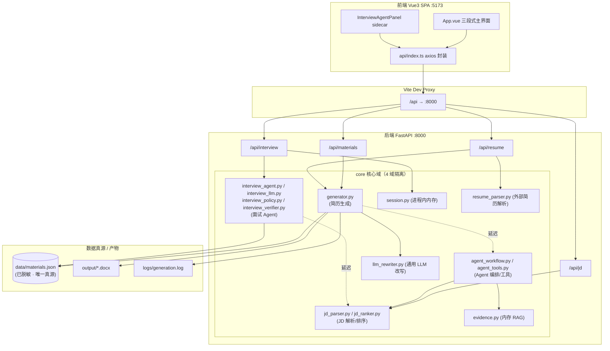
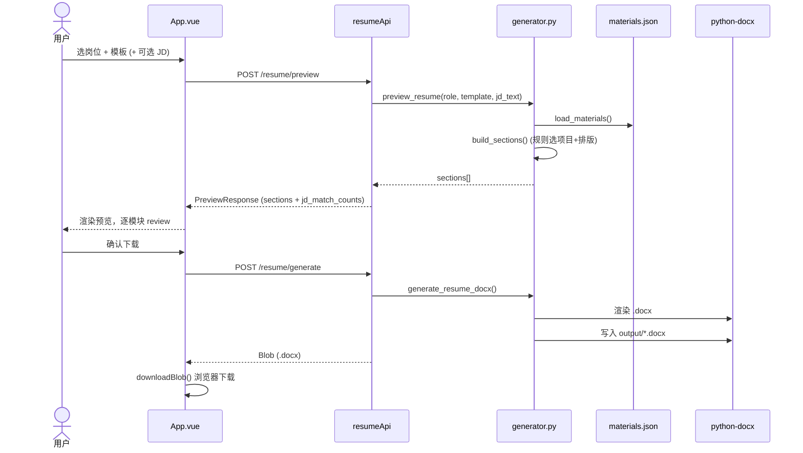
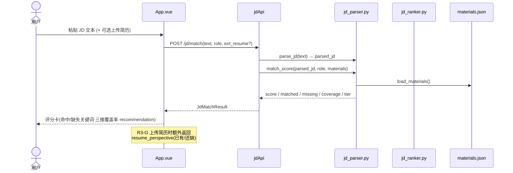
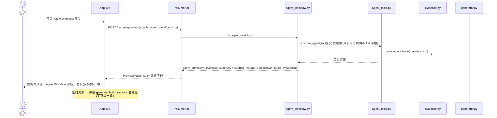
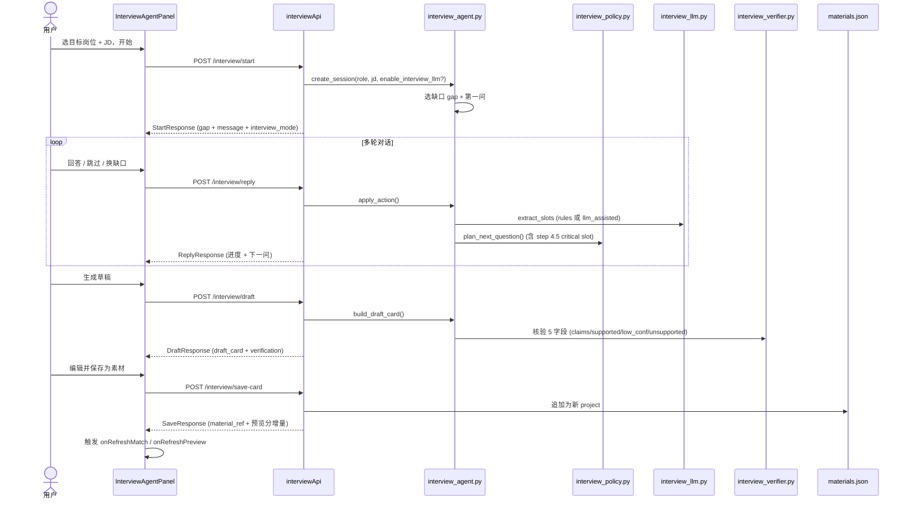

# 简历帮 · 系统架构图与设计文档

> 本文档梳理「简历帮」——一个**本地单用户**的简历助手工具——的整体架构、核心模块职责与四条关键数据流。
> 适用于新成员上手、架构评审与后续 round 规划参考。所有模块名、路由前缀、数据流路径均来自实际源码（`backend/main.py`、`backend/api/*.py`、`backend/core/*.py`、`frontend/src/**`），不虚构未实现内容。

---

## 1. 产品定位与技术栈

**定位**：一份素材库（`materials.json`），一键生成多份针对不同岗位的针对性简历（`.docx`）。附带 JD 匹配评分、Agent 工作流诊断、JD 驱动的面试素材采集三条增强链路。

**关键属性**（来自 `AGENTS.md`）：
- 本地单用户工具，`PUT /api/materials` 无鉴权，**不要直接暴露公网**。
- 唯一业务数据真源 `backend/data/materials.json`（已脱敏）。
- 运行时产物 `output/`（docx）、`logs/`（日志）在 `.gitignore` 中，不进版本库。

**技术栈**：

| 层 | 技术 | 说明 |
|---|---|---|
| 前端 | Vue 3 + TypeScript + Vite | SPA，端口 `:5173`，`/api` 代理到后端 |
| 后端 | Python + FastAPI | 端口 `:8000`，4 个 router，CORS 仅放开 localhost |
| 渲染 | python-docx | `.docx` 生成，规则化排版 |
| LLM | OpenAI-compatible（可选） | env `LLM_API_KEY` 启用，无 key 走纯规则降级 |
| 测试 | pytest | 活跃基线 **948 passed**（R6-G 锁），`scripts/evaluate_interview_agent.py` 评测脚本 |

---

## 2. 系统分层架构图



**分层原则**：
- 路由层（`api/`）只做请求/响应契约与简单校验，业务下沉到 `core/`。
- `core/` 按职责切成 **4 个互不污染的域**：`generator`（生成）、`jd_*`（JD 解析/排序/evidence）、`agent_*`（编排/工具/schema）、`interview_*`（面试 agent）。
- `interview_*` 域**刻意不 import** `llm_rewriter` / `agent_workflow` / `agent_tools` / `evidence`，与通用 LLM 改写层正交，符合 R5-E/R6-E spec 边界。
- 全系统只有 `materials.json` 一个业务数据文件；`evidence` 是运行时从 materials 切片的内存 lexical retrieval，**无向量库/embedding 依赖**。

---

## 3. 后端核心模块职责

### 3.1 路由层（`backend/api/`）

| Router | 前缀 | 职责 | import 的 core |
|---|---|---|---|
| `materials.py` | `/api/materials` | 素材库 CRUD（直接读写 `materials.json`，无鉴权） | 无（直读 JSON） |
| `resume.py` | `/api/resume` | 预览/生成 `.docx`、外部简历解析 | `generator`、`resume_parser`、`logger` |
| `jd.py` | `/api/jd` | JD 解析 + 匹配度评分（纯规则，无 LLM） | `generator`、`jd_parser` |
| `interview.py` | `/api/interview` | 面试 Agent 会话（start/reply/draft/save） | `generator`、`interview_agent`、`interview_prompts`（延迟 `interview_verifier`） |

> 前端 `api/index.ts` 的 4 个 api 对象（`materialsApi`/`resumeApi`/`jdApi`/`interviewApi`）与 4 个 router **严格 1:1 配对**。

### 3.2 核心域（`backend/core/`）

**① 简历生成域**
| 模块 | 职责 | 依赖 |
|---|---|---|
| `generator.py` | sections 构造（规则选项目/模板排版）+ python-docx 渲染；preview 与 generate 共享 `build_sections()` 保证「预览=下载」 | `llm_rewriter`、`jd_ranker`；延迟 `agent_workflow`、`jd_parser` |
| `llm_rewriter.py` | 通用 LLM 改写（`rewrite_highlights`）；`is_llm_enabled()` 由 env `LLM_API_KEY` 决定；无 key 纯规则降级 | 无顶层 core import |
| `resume_parser.py` | R3-G 外部简历解析（`.docx/.pdf/.txt` → 段落 list，纯内存不落盘） | 仅第三方库 |

**② JD 解析/排序域**
| 模块 | 职责 | 依赖 |
|---|---|---|
| `jd_parser.py` | JD 文本解析（skills/tools/domains/tier）、`match_score`、`KEYWORD_GROUPS` 关键词字典（硬编码） | `generator`（ROLE_CONFIG/load_materials） |
| `jd_ranker.py` | 纯函数排序（projects/highlights/skill_groups 按命中数倒序），与 parser **仅靠数据契约耦合**，不 import | 无 |
| `evidence.py` | 运行时从 materials 切片的内存 lexical RAG（`retrieve_evidence`） | `jd_parser` |

**③ Agent 编排域（R5-C）**
| 模块 | 职责 | 依赖 |
|---|---|---|
| `agent_workflow.py` | Plan-and-Execute 编排器，只依赖 `agent_tools` 单一入口；失败降级到 `generator.build_sections` | `agent_tools`、`logger` |
| `agent_tools.py` | 工具注册表 + 统一执行入口（`execute_agent_tool`） | `jd_parser`、`llm_rewriter`、`evidence`、`tool_schema` |
| `tool_schema.py` | 轻量 JSON Schema 子集校验器（纯标准库） | 无 |

**④ 面试 Agent 域（R6）**
| 模块 | 职责 | 依赖 |
|---|---|---|
| `interview_agent.py` | 域聚合门面（facade）：session 创建、action 应用、`extract_slots`、`build_draft_card` | `interview_llm`、`interview_policy`、`jd_parser`、`logger`、`interview_prompts` |
| `interview_llm.py` | LLM 抽取（**独立** `interview_mode` 开关，不复用 `is_llm_enabled`）；与 agent 用 `TYPE_CHECKING` 打破循环依赖 | `interview_prompts` |
| `interview_policy.py` | 受控 Plan-and-Execute 下一问策略（`plan_next_question`，含 step 4.5 critical slot） | `interview_prompts` |
| `interview_prompts.py` | 提示词模板（few-shot 示例不含 JD 原文） | 无 |
| `interview_verifier.py` | draft 核验（5 数字 + 低置信度提示），sentinel 防「假全通过」 | `interview_agent`、`interview_prompts` |
| `session.py` | 进程内会话内存（dict + deque `maxlen=10`，不持久化，线程不安全） | 仅标准库 |

---

## 4. 前端结构

**入口**：`App.vue` —— 三段式主流程（① 选岗位 → ② 预览 → ③ 下载）+ ② JD 评分卡 + 右侧 `InterviewAgentPanel` sidecar（桌面 380px sticky，移动端 FAB + drawer）。

**组件树**：
```
App.vue
├── ResumeUploader.vue        (R3-G 外部简历上传)
└── InterviewAgentPanel.vue   (R6-A Phase 3 面试 Agent)
    ├── InterviewProgressPills.vue
    └── InterviewDraftCard.vue
```

**API 封装**（`src/api/index.ts`，axios `baseURL='/api'`）：

| 对象 | 方法 | 对应后端 |
|---|---|---|
| `materialsApi` | `getSummary` / `getAll` | `/api/materials` |
| `resumeApi` | `listRoles` / `preview` / `generate` / `parseExternal` | `/api/resume` |
| `jdApi` | `parse` / `match` | `/api/jd` |
| `interviewApi` | `start` / `reply` / `draft` / `saveCard` | `/api/interview` |

> 隐私约束：前端只消费聚合计数/摘要（如 `EvidenceSummary` 不展示 `text`），不展示 source_span / prompt / 原文。

---

## 5. 四条核心数据流

### 数据流 A：主简历生成（选岗位 → 预览 → 下载）



要点：`preview` 与 `generate` 共享 `build_sections()`，保证「预览所见即下载所得」；JD 非空时触发 `jd_ranker` 排序 + 预览角标。

### 数据流 B：JD 匹配评分（Round 2 + R3-G）



要点：`jd_parser` 与 `jd_ranker` 靠数据契约（`parsed_jd`）耦合而非 import；纯规则、无 LLM。阈值 ≥80 强烈推荐 / 60-79 建议补充 / <60 需大幅补充（Round 3.5 调优）。

### 数据流 C：R5-C Agent Workflow 诊断（可选开关）



要点：编排层 `agent_workflow` 只依赖 `agent_tools` 单一入口；**失败统一降级到老路径**。前端诊断面板只展示聚合计数/短建议，**不展示 evidence.text / bullet 原文 / JD 原文**（spec §6.4 隐私边界）。

### 数据流 D：R6 面试 Agent 素材采集（JD 驱动对话 → 入库）



要点：session 存于 `session.py` 进程内内存（deque `maxlen=10`，不持久化）；抽取走独立 `interview_mode`（有 key 走 `llm_assisted`，无 key 走 rules）；`interview_verifier` 用 sentinel 防「假全通过」；保存后素材回流 `materials.json`，闭环到数据流 A/B。

---

## 6. 安全与隐私约束

> 本地单用户工具的设计基线，**不是可选项**。

1. **无鉴权**：`PUT /api/materials`、所有 `/api/*` 均无认证。**切勿暴露公网**（AGENTS.md 明确）。
2. **数据已脱敏**：`materials.json` 是唯一真源且已脱敏；不要写入真实姓名/手机/邮箱等 PII。
3. **会话不持久化**：`session.py` 进程内内存，退出即丢、无 TTL、线程不安全（多 worker uvicorn 需加锁，P2）。
4. **API 响应零敏感明文**：所有 interview / agent 响应不含 `LLM_API_KEY` / `Bearer` / `sk-` / prompt 正文 / `source_span` / `user_message` 原文；仅返聚合计数与摘要。
5. **日志脱敏**：`logger.py` / `interview_llm` 只写 `session_id` + 步数到 trace，绝不写 PII；评测脚本 stderr 已脱 `LLM_API_KEY` 字面量 / `sk-` / `Bearer`（R6-G）。
6. **LLM 双开关隔离**：简历改写（`is_llm_enabled`）与面试抽取（`interview_mode`）独立；无 key 均降级纯规则，行为一致。

---

## 7. 已知技术限制

| 项 | 说明 | 影响 |
|---|---|---|
| 进程内会话 | `session.py` dict+deque，不持久化、线程不安全 | 进程重启丢会话；多 worker 需加锁（P2） |
| 单数据真源 | 仅 `materials.json`，无并发写保护 | 并发写可能互相覆盖（本地单用户可接受） |
| 内存 RAG | `evidence.py` lexical retrieval，无向量库 | 仅关键词匹配，无语义检索 |
| 测试基线 | pytest **948 passed**（R6-G 锁） | 回归门槛；新 round 不得回退 |
| 评测脚本 | `scripts/evaluate_interview_agent.py`（`--mode {offline,live,auto}` + `--extractor {rules,llm,compare}`） | live 需 `LLM_API_KEY` + 真实样本回填 |
| JD 库 | 顶层 `AI岗位JD库_v4_intern.json`（86 份，仅个人筛选用）独立于后端代码 | 后端 JD 匹配走 `jd_parser.KEYWORD_GROUPS` 硬编码字典，不读该 JSON |

---

## 8. 快速索引

| 想了解 | 看这里 |
|---|---|
| 后端入口与路由挂载 | `backend/main.py` |
| 简历生成核心 | `backend/core/generator.py` |
| JD 评分 | `backend/api/jd.py` + `backend/core/jd_parser.py` |
| Agent 诊断 | `backend/core/agent_workflow.py` |
| 面试 Agent | `backend/api/interview.py` + `backend/core/interview_agent.py` |
| 前端主界面 | `frontend/src/App.vue` |
| 前端 API 契约 | `frontend/src/api/index.ts` |
| 项目总体指引 | `AGENTS.md` |

---

*文档基于 2026-07-06 代码现状生成，随 round 演进需同步更新。*
